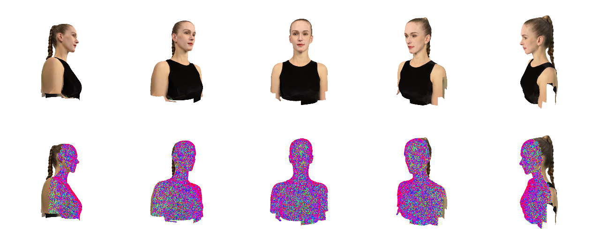
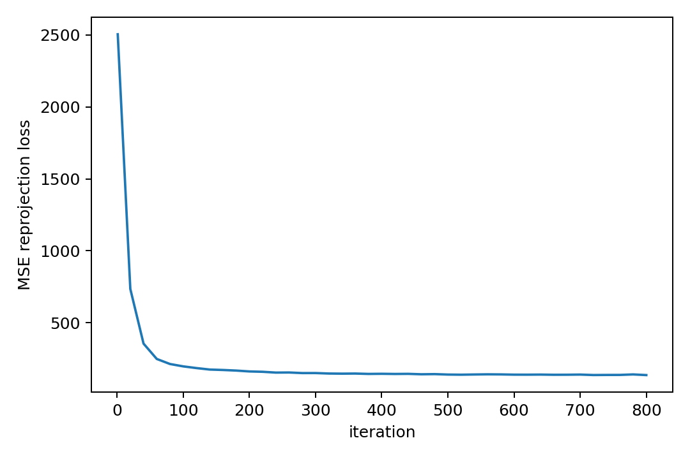
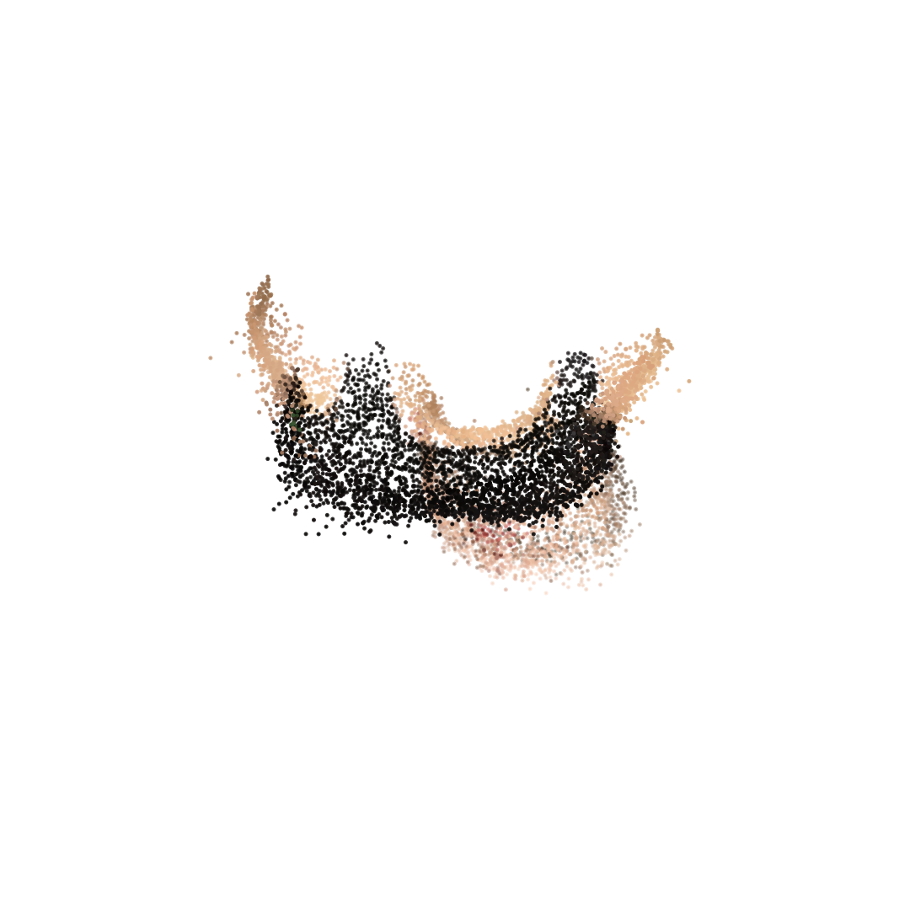

# Assignment 03：Bundle Adjustment 与 COLMAP 三维重建

## 1. 作业简介

本次作业主要完成两个部分：

1. 使用 PyTorch 从 2D 投影点中优化恢复 3D 点云、相机外参和共享焦距；
2. 使用 COLMAP 对 50 张多视角渲染图像进行三维重建。

这里的实现以完成课程作业为目标，代码结构比较简单，没有做复杂工程封装。Bundle Adjustment 部分直接用 Euler 角表示旋转，用 Adam 优化重投影误差。COLMAP 部分提供 Windows 下的 PowerShell 脚本，尽量完成 sparse 和 dense reconstruction。

## 2. 文件结构

```text
Assignment_03/
├── README.md
├── requirements.txt
├── code/
│   ├── bundle_adjustment.py
│   ├── run_colmap.ps1
│   └── run_colmap.bat
├── data/
│   ├── images/
│   ├── points2d.npz
│   └── points3d_colors.npy
├── pics/
│   ├── coordinate_system.png
│   ├── data_overview.png
│   └── result.gif
└── outputs/
    ├── ba/
    └── colmap/
```

## 3. 环境依赖

建议使用 Python 3.9 或以上版本。PyTorch 部分需要：

```bash
cd Assignment_03
pip install -r requirements.txt
```

在我的远程机器上主要使用已有的 `gdl_env` 环境运行：

```bash
conda run -n gdl_env python code/bundle_adjustment.py --device cuda
```

COLMAP 部分需要额外安装 COLMAP。Windows 上可以使用 conda-forge：

```bash
conda create -n colmap_env -c conda-forge colmap
```

如果 dense reconstruction 因为 CUDA 或 COLMAP 版本问题失败，可以只保留 sparse reconstruction 结果。

## 4. 运行方式

### 4.1 PyTorch Bundle Adjustment

快速测试：

```bash
conda run -n gdl_env python code/bundle_adjustment.py --iters 2 --device cuda
```

正式运行：

```bash
conda run -n gdl_env python code/bundle_adjustment.py ^
    --iters 800 ^
    --sample-obs 200000 ^
    --batch-size 65536 ^
    --device cuda
```

Linux/macOS shell 可将 `^` 换成 `\`。

### 4.2 COLMAP 三维重建

在 `Assignment_03` 目录下运行：

```powershell
conda run -n colmap_env powershell -NoProfile -ExecutionPolicy Bypass -File code/run_colmap.ps1
```

或者：

```bat
code\run_colmap.bat
```

脚本会依次执行特征提取、特征匹配、稀疏重建、图像去畸变、PatchMatch Stereo 和 Stereo Fusion。

## 5. 输入和输出

### 输入

- `data/images/`：50 张 1024 x 1024 多视角渲染图像；
- `data/points2d.npz`：每个视角下 20000 个点的 2D 坐标和 visibility；
- `data/points3d_colors.npy`：每个 3D 点对应的 RGB 颜色。

### 输出

Bundle Adjustment 输出在 `outputs/ba/`：

- `loss_curve.png`：优化过程中的 loss 曲线；
- `loss_history.csv`：迭代过程中的 loss、RMSE 和焦距记录；
- `reconstructed_points.obj`：带颜色的点云，格式为 `v x y z r g b`；
- `point_cloud_preview.png`：点云预览图；
- `summary.txt`：运行摘要。

COLMAP 输出在 `outputs/colmap/`：

- `sparse/`：稀疏重建模型；
- `sparse.ply`：稀疏点云导出文件；
- `dense/`：dense reconstruction 工作目录；
- `fused.ply`：如果 dense 成功，会生成融合后的稠密点云；
- `colmap_log.txt`：COLMAP 命令行日志。

## 6. 方法说明

### 6.1 Bundle Adjustment

程序将每个 3D 点、每个相机的 Euler 角和平移、以及共享焦距都作为可学习变量。对于一个世界坐标点 `P`，相机坐标为：

```text
[Xc, Yc, Zc] = R @ P + T
```

然后使用作业给出的投影公式：

```text
u = -f * Xc / Zc + cx
v =  f * Yc / Zc + cy
```

其中 `cx = cy = 512`。优化目标是 predicted 2D point 和 observed 2D point 的均方误差，只使用 visibility 为 1 的观测。

为了让运行时间不要太长，我从所有可见观测中采样一部分，并在每次迭代中用 mini-batch 优化。这种写法不算严格完整的 BA 系统，但可以比较直接地展示重投影误差下降和点云恢复过程。

### 6.2 COLMAP

COLMAP 部分直接使用命令行流程。首先用 SIFT 做特征提取和匹配，然后通过 mapper 得到 sparse reconstruction。后续 dense 部分包括 image undistortion、PatchMatch Stereo 和 stereo fusion。

## 7. 实验结果与分析

### 7.1 数据示意



### 7.2 Bundle Adjustment 结果

loss 曲线如下：



重建点云预览如下：



运行摘要见 `outputs/ba/summary.txt`。从结果看，优化过程中重投影误差可以下降，恢复出的点云大致能形成头部模型的空间结构。由于初始化、迭代次数和简单 Euler 参数化都比较粗糙，点云质量不能和专业 BA/SfM 系统相比，但满足本次课程作业的基本要求。

本次运行使用 CUDA，从可见观测中采样 200000 条进行优化，共迭代 800 次。最终记录的重投影 RMSE 约为 `11.67 px`，焦距优化结果约为 `900.16`。

### 7.3 COLMAP 结果

COLMAP 运行日志保存在：

```text
outputs/colmap/colmap_log.txt
```

如果运行成功，稀疏点云导出为：

```text
outputs/colmap/sparse.ply
```

如果 dense reconstruction 成功，融合点云为：

```text
outputs/colmap/fused.ply
```

本次在远程 Windows 机器上通过 conda-forge 安装 COLMAP 3.13.0 CUDA 版本，完整跑通了 sparse reconstruction、PatchMatch Stereo 和 Stereo Fusion。最终 dense fusion 生成了 `fused.ply`，日志中记录的 fused points 数量为 `114287`。稀疏重建结果也导出了 `outputs/colmap/sparse.ply`。

## 8. 小结

本次作业实现了一个简化版 Bundle Adjustment，并使用 COLMAP 尝试完成多视角图像三维重建。PyTorch 实现部分能直观看到重投影误差下降，并导出带颜色的 OBJ 点云。COLMAP 部分则展示了成熟 SfM 工具从图像到稀疏/稠密点云的完整流程。

## 9. 参考资料

[1] Bundle Adjustment, Wikipedia.  
[2] PyTorch 官方文档。  
[3] COLMAP 官方文档与命令行教程。  
[4] 课程 Assignment 3 README 与教学 slides。  
